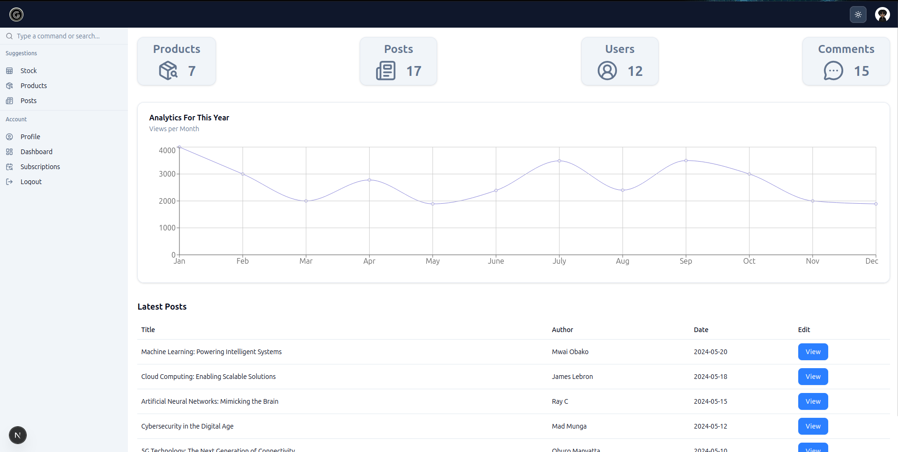
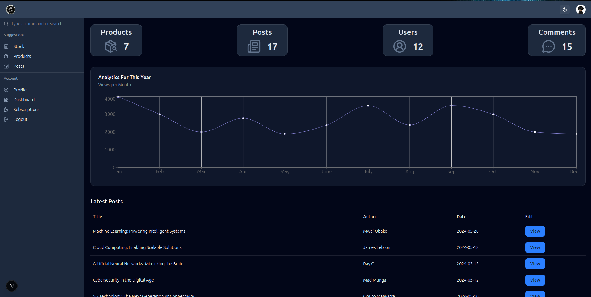

This is a [Next.js](https://nextjs.org) dashboard project with tsx, Tailwind and Shadcn

## 

Install packeges then run the development server:

```bash
npm i

npm run dev
```

Open [http://localhost:3000](http://localhost:3000) with your browser to see the result.


## Preview
Light theme

Dark theme

